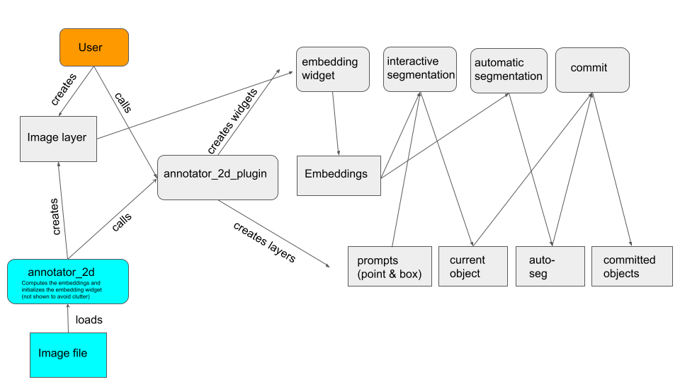

# For Developers

This software consists of four different python (sub-)modules:
- The top-level `micro_sam` module implements general purpose functionality for using Segment Anything for multi-dimensional data.
- `micro_sam.evaluation` provides functionality to evaluate Segment Anything models on (microscopy) segmentation tasks.
- `micro_sam.traning` implements the training functionality to finetune Segment Anything for custom segmentation datasets.
- `micro_sam.sam_annotator` implements the interactive annotation tools.

## Annotation Tools

The annotation tools are implemented as napari plugins.

There are four annotation tools:
- `micro_sam.sam_annotator.annotator_2d`: for interactive segmentation of 2d images.
- `micro_sam.sam_annotator.annotator_3d`: for interactive segmentation of volumetric images.
- `micro_sam.sam_annotator.annotator_tracking`: for interactive tracking in timeseries of 2d images.
- `micro_sam.sam_annotator.image_series_annotator`: for applying the 2d annotation tool to a series of images. This is not implemented as a separate plugin, but as a function that runns annotator 2d for multiple images.

An overview of the functionality of the different tools:

| Functionality | annotator_2d | annotator_3d | annotator_tracking |
| ------------- | ------------ | ------------ | ------------------ |
| Interactive segmentation | Yes | Yes | Yes |
| Interactive segmentation for multiple objects at a time | Yes | No | No |
| Interactive 3d segmentation via projection | No | Yes | Yes |
| Support for dividing objects | No | No | Yes |
| Automatic segmentation | Yes | Yes | No |

The functionality for `image_series_annotator` is not listed because it is identical with the functionality of `annotator_2d`.

Each tool implements the follwing core logic:
1. The image embeddings (prediction from SAM image encoder) are pre-computed for the input data (2d image, image volume or timeseries). These embeddings can be cached to a zarr file.
2. Interactive (and automatic) segmentation functionality is implemented by a UI based on `napari` and `magicgui` functionality.

Each tool has three different entry points:
- From napari plugin menu, e.g. `plugin->micro_sam->Annotator 2d`. (Called *plugin* in the following).
- From a python function, e.g. `micro_sam.sam_annotator.annotator_2d:annotator_2d`.  (Called *function* in the following.)
- From the command line, e.g. `micro_sam.annotator_2d`. (Called *CLI* in the following).

Each tool is implemented in its own submodule, e.g. `micro_sam.sam_annotator.annotator_2d`.
The napari plugin is implemented by a class, e.g. `micro_sam.sam_annotator.annotator_2d:Annotator2d`, inheriting from `micro_sam.sam_annotator._annotator._AnnotatorBase`. This class implements the core logic for the plugins.
The concrete annotation tools are instantiated by passing widgets from `micro_sam.sam_annotator._widgets` to it, 
which implement the interactive segmentation in 2d, 3d etc.
These plugins are designed so that image embeddings can be computed for user-specified image layers in napari.

The *function* and *CLI* entry points are implemented by `micro_sam.sam_annotator.annotator_2d:annotator_2d` (and corresponding functions for the other annotation tools). They are called with image data, precompute the embeddings for that image and start a napari viewer with this image and the annotation plugin.

<!--
TODO update the flow chart so that it matches the new design.
The same overall design holds true for the other plugins. The flow chart below shows a flow chart with a simplified overview of the design of the 2d annotation tool. Rounded squares represent functions or the corresponding widget and squares napari layers or other data, orange represents the *plugin* enty point, cyan *CLI*. Arrows that do not have a label correspond to a simple input/output relation.

-->

<!---
Source for the diagram is here:
https://docs.google.com/presentation/d/1fMDNBYMYxeqe4dk6OmmFxoI8sYvCu4EPZS_LyTsTg_s/edit#slide=id.p
-->
